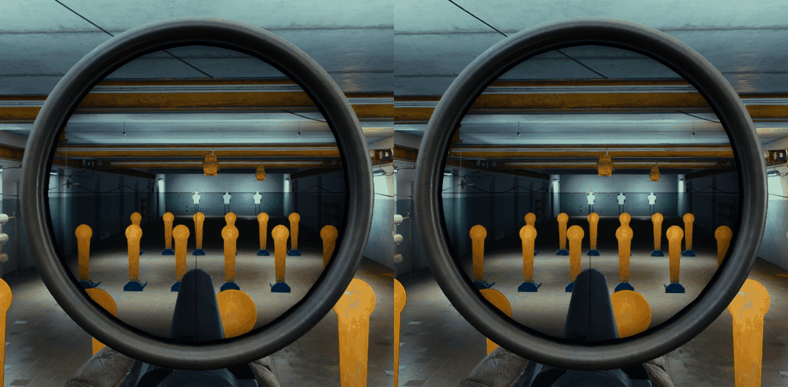

## First of all - HUGE Props to space-commits/Fontaine for all the amazing work!

# Non-linear zoom
Now there is the choice of "UseLinearZoomStepSize" in the configuration manager. It is on by default, for default behaviour - the (fix) "ZoomStepSize".
The zoom-steps now are distributed with increasing zoom-change. Although it might look look weird in the comparison-images (below), but to me it always felt unnatural to zoom (visually) more in lower magnifications, than in higher ones. I never really had the control in lower zoom for small changes and the steps in higher ranges felt unnecessary high (most obvious in the ATACR image, below).
When "UseLinearZoomStepSize" is disabled the "ZoomStepSize" is ignored. I was thinking about and testing different solutions, e.g. a configurable "ZoomStepNum" - in how many steps the zoom-range would be split, but for the Vortex 1x-6x and the ATACR 7x-35x it would never be a ideal solution.
So i thought about using the "ZoomStepSize" and calc. the Number of Steps you'd have for each zoom-range, but again you'd get something like (with "ZoomStepSize" = 1.0) 5 steps for Vortex and 28 for ATACR, which also is not preferable.

The solution so far is a predefined, fixed setup of a linear distribution: m=0.2 (slope) and b=4 (y-intercept) with x being the zoom-range (e.g. razor 6x-1x => x = 5) and the guessed as preferable y being the number of zoom-steps (for razor => y = 5). The same for a S&B PM II 5x-25 => x = 20 and again guessed as preferable y = 8.
The downside is (so far), that you can't modify these number of zoom-steps (in the configuration manager), since the values m and t are not intuitive and a mulitplier or offset (on top) probably doesn't work that great either. Maybe (in the future) something like "MinZoomSteps" (for Vudu/Razor) and "MaxZoomSteps" (for ATACR).

Examples for the number of Steps would be accordingly:
| Scope | Zoom-Range | Zoom-Steps|
|-----|-----|-----|
| Razor / Vudu 1x-6x | 5x | 5 |
| S&B PM II 1x-8x | 7x | 5 |
| S&B PM II 3x-12x | 9x | 6 |
| Leupold Mk4 6.5x-20x | 13.5x | 7 |
| S&B PM II 5x-25x | 20x | 8 |
| March Tactical FFP 3x-24x | 21x | 8 |
| Nightforce ATACR 7x-35x | 28x | 10 |

(with 10 being my estimated max, to still be able to scroll from min- to max-zoom.

## Comparison-Images
### (always left: default/fixed ZoomStepSize and right: non-linear zoom)
#### Razor 1x-6x

#### Vudu 1x-6x

#### S&B PM II 1x-8x

#### S&B PM II 3x-12x

#### March Tactical FFP 3x-24x

#### Nightforce ATACR 7x-35x

